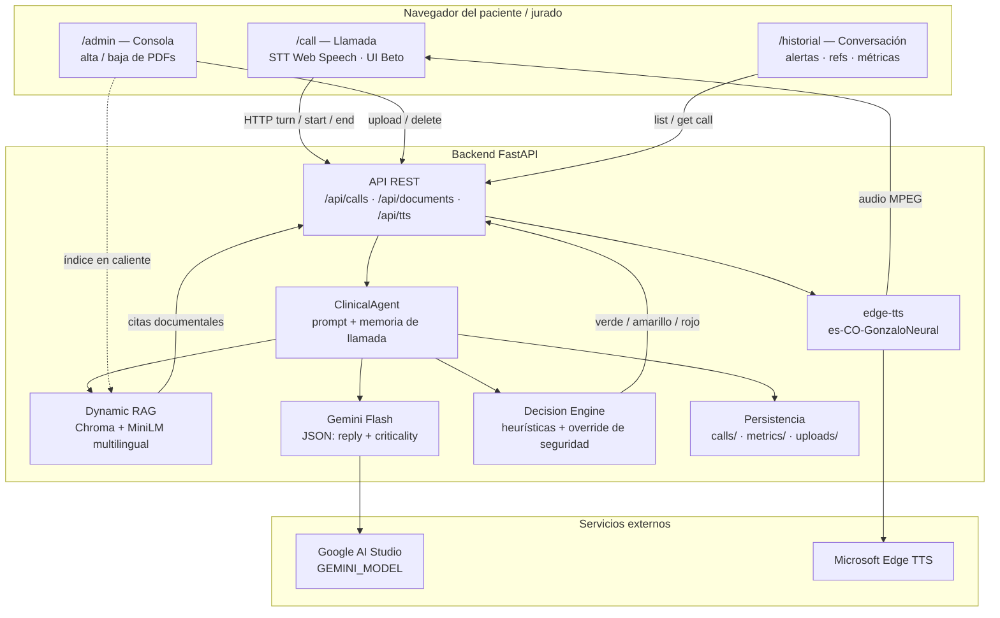
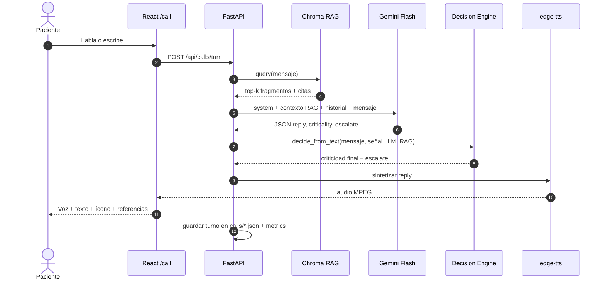
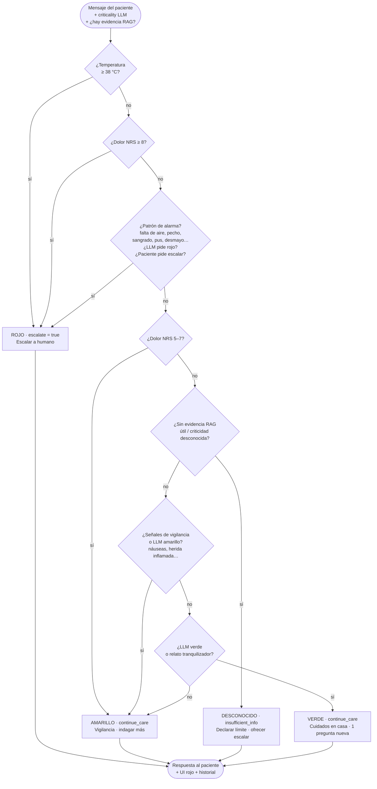
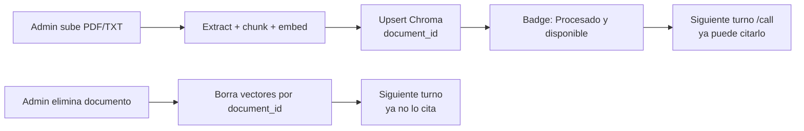

# Arquitectura — PostOp Care

Documento de entregable: **diagrama de la solución** y **flujo de decisión del agente**.

Este archivo es la fuente oficial del diagrama (GitHub renderiza los bloques Mermaid). El video demo está en [Google Drive](https://drive.google.com/drive/folders/1mVbegDRf-KAdfi5Z2rJQiof30KVWQOBl?usp=sharing).

---

## 1. Arquitectura de la solución (componentes)

### Lectura rápida

| Capa | Qué hace |
|---|---|
| **UI `/call`** | Voz/texto, saludo de Beto, criticidad, botón Ver referencias |
| **UI `/admin`** | Conocimiento vivo (G5): indexar o borrar PDF/TXT sin reiniciar |
| **UI `/historial`** | Transcript, alerta final, refs por turno, latencias |
| **ClinicalAgent** | Orquesta RAG + Gemini + memoria; anti-repetición de preguntas |
| **Decision Engine** | No se fía solo del LLM: prioriza no perder rojos |
| **RAG** | Chroma + embeddings; citas con filename / página / excerpt |

---

## 2. Flujo de un turno de llamada (secuencia)

### Pasos en prosa

1. `/calls/start` crea `call_id` y saludo hablado.
2. El paciente habla (Web Speech) o escribe.
3. RAG recupera top-k fragmentos; Gemini responde en JSON corto y hablable.
4. El **Decision Engine** combina señales del relato con la salida del LLM (asimetría clínica).
5. La UI muestra respuesta, criticidad y fuentes.
6. TTS reproduce la respuesta.
7. Al finalizar, queda el resumen en `backend/data/calls/`.

---

## 3. Flujo de decisión del agente (Decision Engine)

Principio: **mejor un falso positivo controlado que un falso negativo** (no alertar cuando había que alertar).

### Señales que disparan **rojo** (ejemplos)

- Fiebre / temperatura ≥ **38 °C**
- Dolor ≥ **8 / 10**
- Falta de aire, dolor de pecho, sangrado abundante, pus/secreción, desmayo
- El paciente pide explícitamente hablar con un humano / escalar
- El LLM marca `criticality=rojo` o `escalate=true` (el motor lo respeta)

### **Amarillo**

- Dolor 5–7, náuseas, herida un poco inflamada, fiebre bajita, etc.
- Seguimiento en casa + **una** pregunta concreta (sin repetir la anterior)

### **Verde**

- Evolución esperada / relato tranquilizador con evidencia RAG
- Cuidados orientados al corpus + pregunta nueva o cierre

### **Desconocido**

- Sin evidencia documental suficiente → no inventar; declarar límite u ofrecer escalar

---

## 4. Conocimiento vivo (G5)

- Alta: `POST /api/documents`
- Baja: `DELETE /api/documents/{id}`
- Sin reinicio del agente ni del índice global

---

## 5. Decisiones técnicas clave

| Decisión | Alternativas | Elección | Riesgo |
|---|---|---|---|
| LLM | Groq Llama, Ollama, Gemini Flash | Gemini Flash | Cuota free tier (429) |
| Embeddings | BGE-M3, Gemini emb., MiniLM | MiniLM multilingual | Menos precisión que BGE; más liviano (G2) |
| STT | Whisper, Web Speech | Web Speech | Ruido / Opera |
| TTS | Kokoro, Piper, edge-tts | edge-tts Gonzalo | Dependencia Edge; sin API key |
| Orquestación | LangChain, custom | FastAPI custom | Más control de prompts y citas |

---

## 6. Persistencia

| Ruta | Contenido |
|---|---|
| `backend/data/chroma/` | Índice vectorial + registry |
| `backend/data/uploads/` | Archivos originales |
| `backend/data/calls/` | Transcripts, decisiones, sources por turno |
| `backend/data/metrics/events.json` | Latencia / tokens / costo estimado |

---

## 7. Superficies de la aplicación

| Ruta | Contrato |
|---|---|
| `/call` | Llamada de voz + chat |
| `/admin` | Conocimiento vivo |
| `/historial` | Observabilidad y métricas |
