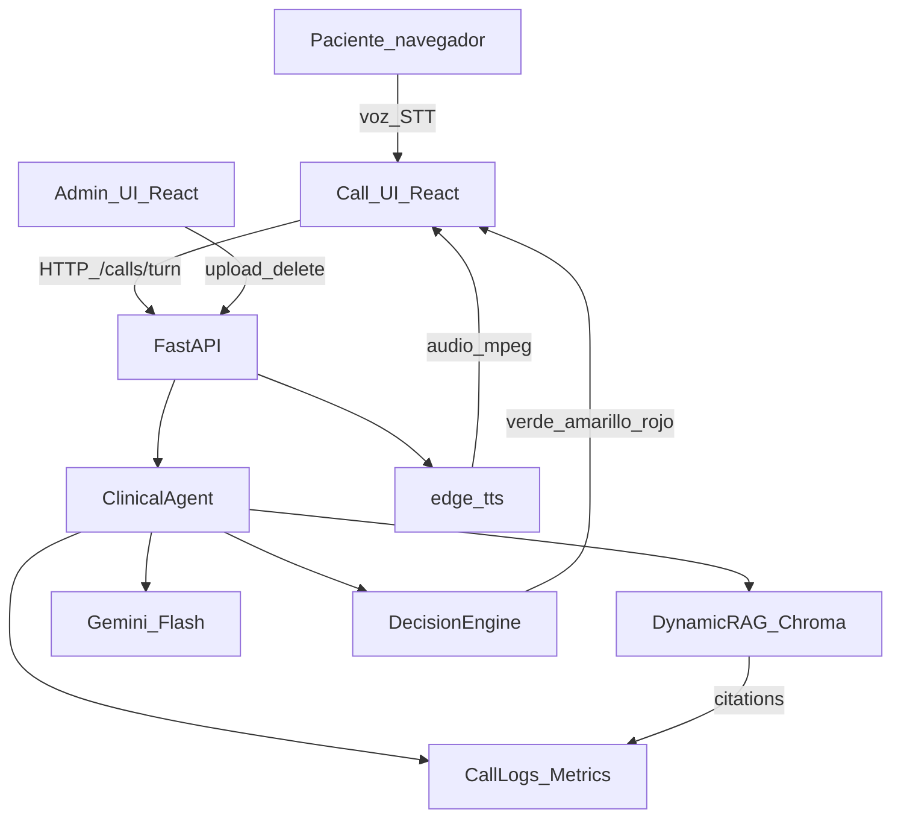

# Arquitectura — PostOp Care

## Diagrama de componentes

## Flujo de una llamada

1. `/calls/start` crea `call_id` y saludo.
2. El paciente habla (Web Speech API) o escribe.
3. El backend embebe la consulta, recupera top-k fragmentos en Chroma y llama a Gemini Flash con prompt clínico restringido.
4. El **Decision Engine** combina señales heurísticas (alarma / vigilancia) con la criticidad del LLM. Asimetría clínica: prioriza no perder rojos.
5. La UI muestra respuesta, criticidad y **fuentes** (`filename`, página, excerpt).
6. TTS sintetiza la respuesta (`es-CO-GonzaloNeural`, voz masculina colombiana).
7. Al finalizar, se persiste resumen estructurado en `backend/data/calls/`.

## RAG dinámico (G5)

- Alta: `POST /api/documents` → extract → chunk → embed → upsert Chroma + registry JSON.
- Estado visible: `Procesado y disponible`.
- Baja: `DELETE /api/documents/{id}` elimina vectores por metadata `document_id` y el archivo.
- Durante una llamada en curso, el siguiente turno ya ve el corpus actualizado (no hay caché de índice en el agente).

## Decisiones técnicas clave

| Decisión | Alternativas | Elección | Riesgo |
|---|---|---|---|
| LLM | Groq Llama, Ollama local, Gemini Flash | Gemini Flash | Rate limit free tier |
| Embeddings | BGE-M3 pesado, Gemini embeddings, MiniLM multilingüe | MiniLM multilingüe | Algo menos preciso que BGE-M3; setup más liviano (G2) |
| Voz STT | Groq Whisper, Web Speech | Web Speech primero | Calidad variable; Whisper opcional después |
| TTS | Kokoro, Piper, edge-tts | edge-tts | Dependencia de servicio Edge; sin API key |
| Orquestación | LangChain, custom | Custom FastAPI | Menos magia, más control de prompts/citas |

## Superficies

- **`/call`**: contrato de llamada de voz.
- **`/admin`**: contrato de conocimiento vivo.
- **`/historial`**: observabilidad y métricas.

## Persistencia

| Ruta | Contenido |
|---|---|
| `backend/data/chroma/` | Índice vectorial + `documents.json` |
| `backend/data/uploads/` | Archivos originales |
| `backend/data/calls/` | Transcripts y resúmenes |
| `backend/data/metrics/events.json` | Eventos de latencia/tokens |
